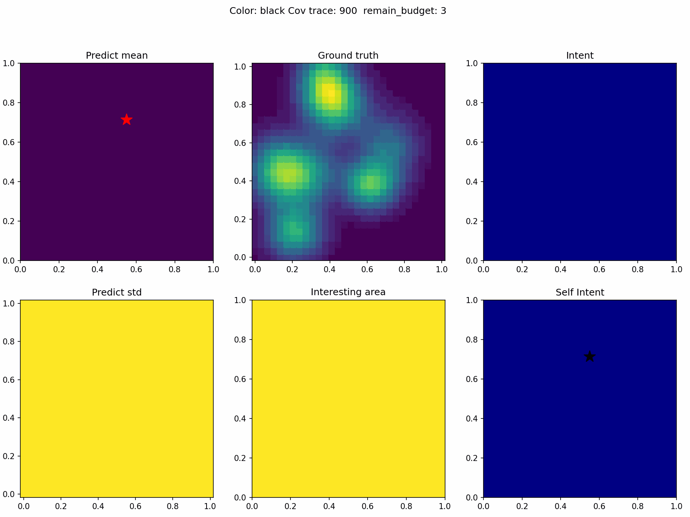

<h1 align="center"> AID: Agent Intent from Diffusion for Multi-Agent Informative Path Planning </h1>

<div align="center">



</div>

---
### Installation

1. **Create the conda environment**:

	```bash
	conda create -n env_aid python=3.12 -y
	```

2. **Activate the environment**:

	```bash
	conda activate env_aid
	```

3. **Clone this repository:**
   ```bash
   git clone https://github.com/marmotlab/AID.git
   ```

4. **Install this repository in editable mode** (from the repo root):

	```bash
    cd AID
	pip install -e .
	```
---

### Usage
**Dataset Collection**
```bash
python script/run.py --config-name dataset_rigtree_gpipp_delta.yaml --config-dir config/dataset
```

**Pre-train with dataset**
```bash
python script/run.py --config-name pre_diffusion_unet_gpipp_delta_rigtreedata.yaml --config-dir config/pretrain
```

**Fine-tune with DPPO**
```bash
python script/run.py --config-name ft_ppo_diffusion_unet_gpipp_delta_rigtreedata.yaml --config-dir config/finetune
```

**Evaluate fine-tuned model**
```bash
python script/run.py --config-name eval_ft_ppo_diffusion_unet_gpipp_delta_rigtreedata.yaml --config-dir config/eval
```

## Credit
If you find this work useful, please consider citing us and the following works:

+ AID: Agent Intent from Diffusion for Multi-Agent Informative Path Planning

```bibtex
@article{lew2025aid,
      title={AID: Agent Intent from Diffusion for Multi-Agent Informative Path Planning}, 
      author={Jeric Lew and Yuhong Cao and Derek Ming Siang Tan and Guillaume Sartoretti},
      year={2025},
      eprint={2512.02535},
      archivePrefix={arXiv},
      primaryClass={cs.RO},
      url={https://arxiv.org/abs/2512.02535}, 
}
```

+ Intent-based Deep Reinforcement Learning for Multi-agent Informative Path Planning

```bibtex
@inproceedings{yang2023intent,
  title={Intent-based deep reinforcement learning for multi-agent informative path planning},
  author={Yang, Tianze and Cao, Yuhong and Sartoretti, Guillaume},
  booktitle={2023 International Symposium on Multi-Robot and Multi-Agent Systems (MRS)},
  pages={71--77},
  year={2023},
  organization={IEEE}
}
```

+ CAtNIPP: Context-Aware Attention-based Network for Informative Path Planning

```bibtex
@InProceedings{cao2022catnipp,
  title = {Context-Aware Attention-based Network for Informative Path Planning},
  author = {Cao, Yuhong and Wang, Yizhuo and Vashisth, Apoorva and Fan, Haolin and Sartoretti, Guillaume},
  booktitle = {6th Annual Conference on Robot Learning},
  year = {2022}
}
```

We build on the codebase from [IntentMAIPP](https://github.com/marmotlab/MAIPP) and [DPPO](https://github.com/irom-princeton/dppo):

+ Ren, A.Z., Lidard, J., Ankile, L.L., Simeonov, A., Agrawal, P., Majumdar, A., Burchfiel, B., Dai, H., Simchowitz, M.: Diffusion policy policy optimization.


```bibtex
@inproceedings{dppo2024,
    title={Diffusion Policy Policy Optimization},
    author={Ren, Allen Z. and Lidard, Justin and Ankile, Lars L. and Simeonov, Anthony and Agrawal, Pulkit and Majumdar, Anirudha and Burchfiel, Benjamin and Dai, Hongkai and Simchowitz, Max},
    booktitle={arXiv preprint arXiv:2409.00588},
    year={2024}
}
```