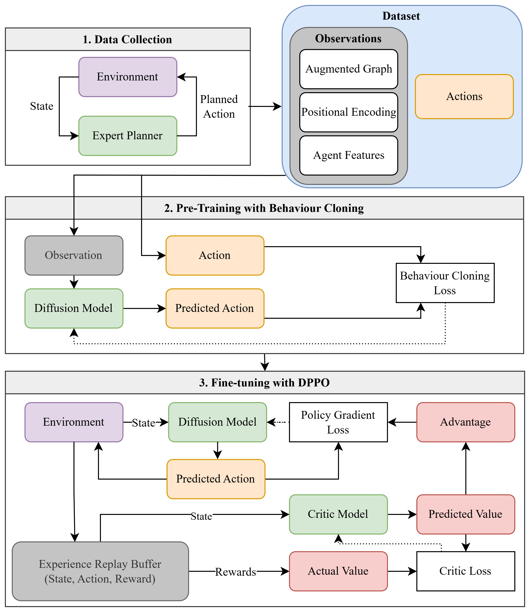

<h1 align="center"> AID: Agent Intent from Diffusion for Multi-Agent Informative Path Planning </h1>

<div align="center">

[](https://arxiv.org/abs/2512.02535)
[](https://ubuntu.com/blog/tag/22-04-lts)
[]()


</div>

---

## Introduction
Efficient information gathering in large-scale, time-critical scenarios (e.g. search and rescue or environmental monitoring) requires the coordinated effort of multiple agents. **AID (Agent Intent from Diffusion)** is a fully decentralized framework designed for Multi-Agent Informative Path Planning (MAIPP), addressing the challenge of maximizing collective information gain under strict constraints. While previous methods rely on computationally expensive autoregressive models to predict agent "intent," AID leverages the power of generative AI to produce robust long-term plans.

AID utilizes **diffusion models** to generate long-horizon trajectories in a non-autoregressive manner. By employing a two-stage pipeline—first performing behavior cloning on trajectories from existing planners and then fine-tuning via **Diffusion Policy Policy Optimization (DPPO)**—AID inherits expert behaviors while learning superior coordination strategies through online reward feedback.

**Key Features:**
*   **Non-Autoregressive Planning:** Leverages diffusion models to generate stable, long-term trajectories without the computational cost of autoregressive steps.
*   **Two-Stage Learning:** Combines behavior cloning from expert demonstrations with reinforcement learning fine-tuning to optimize policy performance.
*   **Superior Efficiency:** Achieves up to **4x faster execution** and **17% increased information gain** compared to baseline MAIPP planners.
*   **Scalable Coordination:** A fully decentralized framework that scales effectively to larger numbers of agents while maintaining robust cooperation.

<div align="center">

</div>

---

## Usage
### Requirements
Install the following dependencies in a conda environment as shown below:
```bash
git clone https://github.com/marmotlab/AID.git && cd AID
conda create -n env_aid python=3.12 -y
conda activate env_aid
pip install -e .
```

### Running Experiments
**Dataset Collection**
```bash
python script/run.py --config-name dataset_rigtree_gpipp_delta.yaml --config-dir config/dataset
```

**Pre-train with dataset**
```bash
python script/run.py --config-name pre_diffusion_unet_gpipp_delta_rigtreedata.yaml --config-dir config/pretrain
```

**Fine-tune with DPPO**
```bash
python script/run.py --config-name ft_ppo_diffusion_unet_gpipp_delta_rigtreedata.yaml --config-dir config/finetune
```

**Evaluate fine-tuned model**
```bash
python script/run.py --config-name eval_ft_ppo_diffusion_unet_gpipp_delta_rigtreedata.yaml --config-dir config/eval
```

## Credit
If you find this work useful, please consider citing us and the following works:

+ AID: Agent Intent from Diffusion for Multi-Agent Informative Path Planning

```bibtex
@article{lew2025aid,
      title={AID: Agent Intent from Diffusion for Multi-Agent Informative Path Planning}, 
      author={Jeric Lew and Yuhong Cao and Derek Ming Siang Tan and Guillaume Sartoretti},
      year={2025},
      eprint={2512.02535},
      archivePrefix={arXiv},
      primaryClass={cs.RO},
      url={https://arxiv.org/abs/2512.02535}, 
}
```

+ Intent-based Deep Reinforcement Learning for Multi-agent Informative Path Planning

```bibtex
@inproceedings{yang2023intent,
  title={Intent-based deep reinforcement learning for multi-agent informative path planning},
  author={Yang, Tianze and Cao, Yuhong and Sartoretti, Guillaume},
  booktitle={2023 International Symposium on Multi-Robot and Multi-Agent Systems (MRS)},
  pages={71--77},
  year={2023},
  organization={IEEE}
}
```

+ CAtNIPP: Context-Aware Attention-based Network for Informative Path Planning

```bibtex
@InProceedings{cao2022catnipp,
  title = {Context-Aware Attention-based Network for Informative Path Planning},
  author = {Cao, Yuhong and Wang, Yizhuo and Vashisth, Apoorva and Fan, Haolin and Sartoretti, Guillaume},
  booktitle = {6th Annual Conference on Robot Learning},
  year = {2022}
}
```

+ Diffusion policy policy optimization

```bibtex
@inproceedings{dppo2024,
    title={Diffusion Policy Policy Optimization},
    author={Ren, Allen Z. and Lidard, Justin and Ankile, Lars L. and Simeonov, Anthony and Agrawal, Pulkit and Majumdar, Anirudha and Burchfiel, Benjamin and Dai, Hongkai and Simchowitz, Max},
    booktitle={arXiv preprint arXiv:2409.00588},
    year={2024}
}
```

We build on the codebase from [IntentMAIPP](https://github.com/marmotlab/MAIPP) and [DPPO](https://github.com/irom-princeton/dppo).